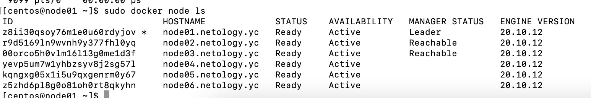
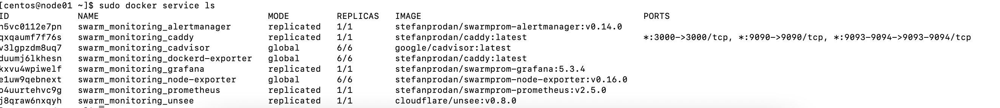

## Задача 1

Дайте письменые ответы на следующие вопросы:

В чём отличие режимов работы сервисов в Docker Swarm кластере: replication и global?
Какой алгоритм выбора лидера используется в Docker Swarm кластере?
Что такое Overlay Network?

-В режиме replication можно задать точное количество копий(реплиткаций) конкретного сервиса на ноды, 
в режиме global - на всех нодах сохраняются все сервисы.

-используется алгоритм RAFT. Изначально нода помечается либо как обычный воркер, либо как кандидат.
Если кандидат теряет свящь с лидером (спустя оговоренный таймаут), он переходит в режим кандидата и начинает голосование - выставляя свою кандидатуру.
Он посылает сообщение всем нодам с параметром, увеличенным на 1, по сравнению с прошлым лидером и ждет их ответа.
Если он получил более половины откликов со своим значением параметра, то сам становится лидером.
Если получил сообщение с параметром, увеличенным на 1 от егозначения - то переходит в режим воркера и подчиняется другому лидеру.

-

## Задача 2

Создать ваш первый Docker Swarm кластер в Яндекс.Облаке

Для получения зачета, вам необходимо предоставить скриншот из терминала (консоли), с выводом команды:

docker node ls

  

## Задача 3

Создать ваш первый, готовый к боевой эксплуатации кластер мониторинга, состоящий из стека микросервисов.

Для получения зачета, вам необходимо предоставить скриншот из терминала (консоли), с выводом команды:

docker service ls

  

## Задача 4 (*)

Выполнить на лидере Docker Swarm кластера команду (указанную ниже) и дать письменное описание её функционала, что она делает и зачем она нужна:

# см.документацию: https://docs.docker.com/engine/swarm/swarm_manager_locking/
docker swarm update --autolock=true

[root@node01 ~]# docker swarm update --autolock=true
Swarm updated.
To unlock a swarm manager after it restarts, run the `docker swarm unlock`
command and provide the following key:

This feature allows us to manually manage keys used to encrypt raft logs. This option makes it reqquired do provide key to decrypt raft logs and to access swarm after docker restart.
